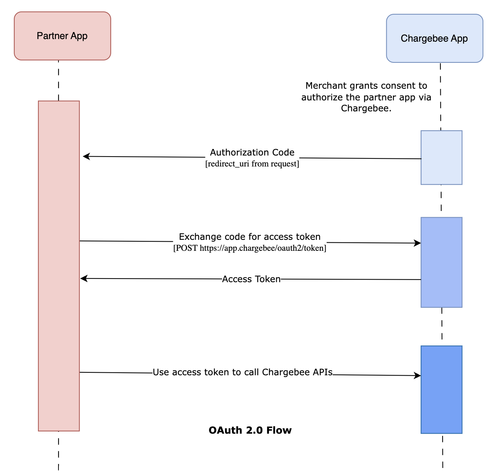

## Overview

Partner adapter apps must be authorized by Chargebee using the OAuth 2.0 Authorization. This allows your app to securely call Chargebee APIs (such as webhook callbacks) on behalf of a merchant after consent is given.

This guide explains how Chargebee initiates the flow, how your adapter should implement Oauth flows, and best practices for secure implementation.

---

## OAuth 2.0 Flow Overview
The OAuth 2.0 authorization flow consists of these main steps:
- User Authorization: Redirect users to Chargebee's authorization server
- User Consent: Users review and grant permission to your application
- Authorization Code: Chargebee returns a temporary authorization code
- Token Exchange: Exchange the code for access and refresh tokens
- API Access: Use the access token to make authenticated API calls
- Token Refresh: Use refresh tokens to obtain new access tokens when needed



### Prerequisites
Before implementing OAuth 2.0, ensure you have:

- A Chargebee partner sandbox account.
- Client ID and Client Secret from Chargebee.
- Understanding of your application's required scopes.
- HTTPS-enabled application (required for production).

---

### Supported Grant Types

Chargebee OAuth 2.0 currently supports the following grant types:

- **Authorization Code Flow**  
  Recommended for web-based applications and server-side implementations that require secure, user-authorized access.

- **Refresh Token Flow**  
  Used to obtain a new access token without requiring user reauthorization, after the original access token expires.


### Step 1: App Registration by Chargebee
- Once you have submitted your app following the [onboarding process](../../../app-onboarding/guide), Our team will review your application and the client credentials will be shared with you securely.

> **Note:** The credential provisioning process typically takes **2–3 business days**. Please ensure your application details are accurate to help us process your request faster.

---

### Step 2: Merchant Authorization via Chargebee UI

When a Chargebee merchant connects your app:

- Chargebee displays a **consent screen** to the merchant.
- After approval, Chargebee redirects the user to your registered `redirect_uri` with:
  - An `authorization_code`
  - An optional `state` parameter for CSRF protection

```http
GET https://your-app.com/oauth/callback?
  code=AUTH_CODE_REDACTED
  state=STATE_REDACTED
```
---
### Step 3: Exchange Authorization Code for Tokens

Once your adapter app receives the `code` parameter from Chargebee via the redirect URI, you must exchange it for an `access_token` and `refresh_token` using the token endpoint.

#### Token Request (cURL)

```bash
curl -X POST 'https://app.chargebee.com/oauth/token' \
  -u "${CLIENT_ID}:${CLIENT_SECRET}" \
  -d 'grant_type=authorization_code' \
  -d 'code=AUTH_CODE_REDACTED' \
  -d 'redirect_uri=https://your-app.com/oauth/callback'
```

#### Sample response
```json 
{
  "access_token": "ACCESS_TOKEN_REDACTED",
  "refresh_token": "REFRESH_TOKEN_REDACTED",
  "token_type": "Bearer",
  "expires_in": 3600,
  "scope": "einvoicing.write"
}
```
---
### Step 4: Make Authorized API Calls to Chargebee

Once the access token is available, your adapter app can call Chargebee APIs (such as posting document status updates).

#### Example API Call (cURL)
````bash
curl -X POST 'https://{chargebee-domain}.chargebee.com/webhooks/einvoicing/{partner-id}/document_status' \
  -H 'Authorization: Bearer {access_token}' \
  -H 'Content-Type: application/json' \
  -d '{
        "document_id": "INV-1001",
        "status": "ACCEPTED"
      }'
````

Chargebee will validate the token and the partner-id for authorization before accepting the request.

**Note**: The domain identifier is contained within the access token claims. You'll need to decode the JWT access token 
to extract the domain information for constructing the API URL: https://{domain}.chargebee.com/api/v2/.

#### Access Token Claims

The access token issued by Chargebee is a **JWT (JSON Web Token)**. It contains encoded claims that provide metadata about the authorization context.

To extract the Chargebee domain, which is required to construct the correct API URL:

1. Decode the JWT payload (the **second** part of the JWT: `header.payload.signature`)
2. Extract the `domain` claim from the decoded payload
3. Use the value of `domain` to construct the API base URL

#### Example JWT Payload

```json
{
  "iss": "https://app.chargebee.com",
  "sub": "user_id",
  "aud": "https://app.chargebee.com",
  "exp": 1640995200,
  "iat": 1640991600,
  "scope": "einvoicing.write",
  "domain": "your-site-name"
}
```
---
### Step 5: Refresh Access Tokens

Access tokens are short-lived. When expired, use the refresh_token to obtain a new access token without requiring the merchant to authorize again.

### Refresh Token Request

````curl
curl -X POST 'https://app.chargebee.com/oauth/token' \
  -H 'Content-Type: application/x-www-form-urlencoded' \
  -u "${CLIENT_ID}:${CLIENT_SECRET}" \
  -d 'grant_type=refresh_token' \
  -d 'refresh_token=REFRESH_TOKEN_REDACTED'
````
---
### Security Best Practices
- Always use HTTPS for all OAuth communications in production environments.
- Store client secrets securely using environment variables or secure key management systems.
- Implement proper token validation and verification on every request.
- Never expose access tokens in client-side code or public repositories.
- Implement proper error handling for token-related operations.
- Regularly rotate client secrets as part of your security practices.