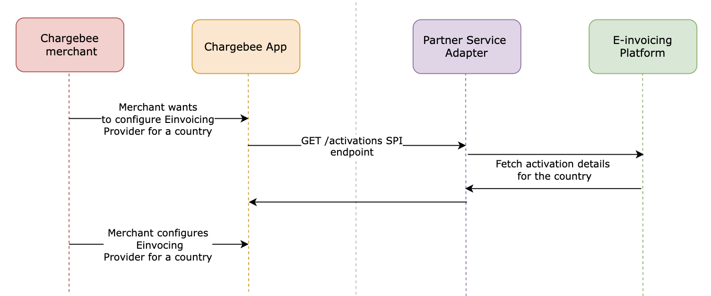
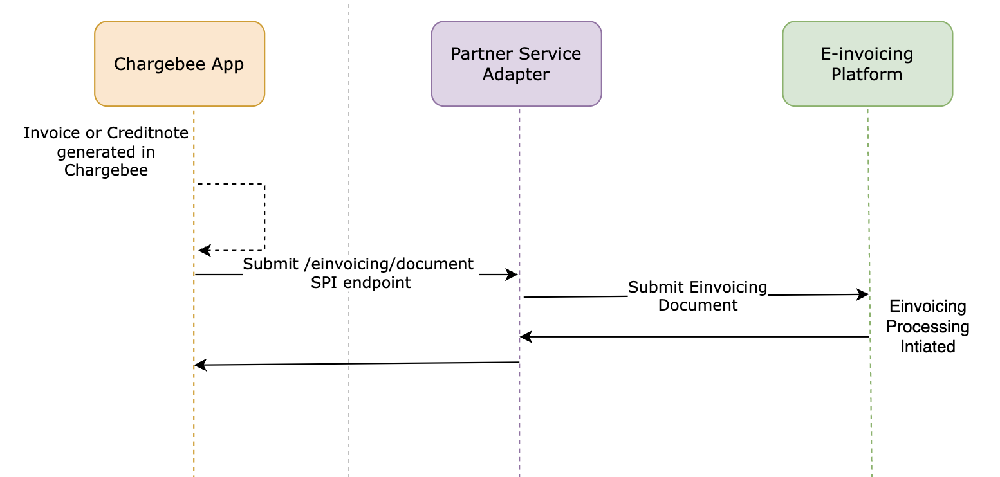
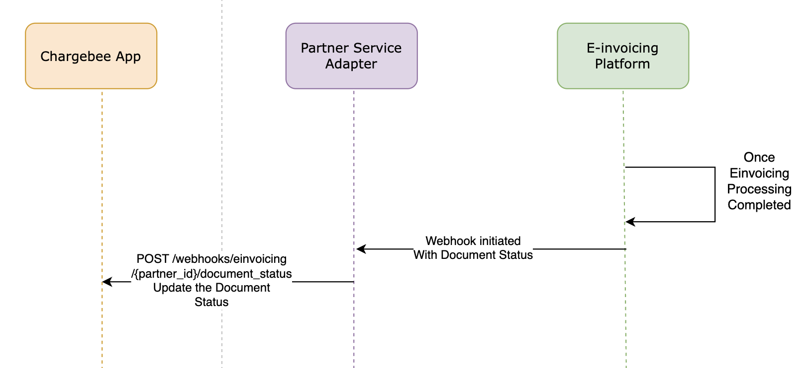
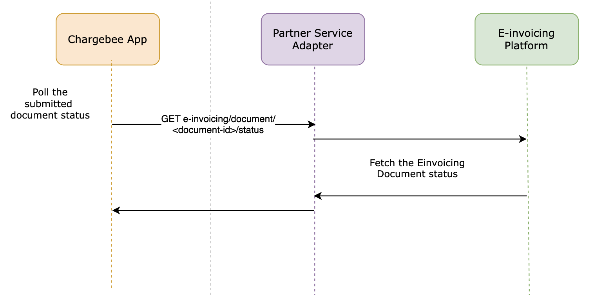
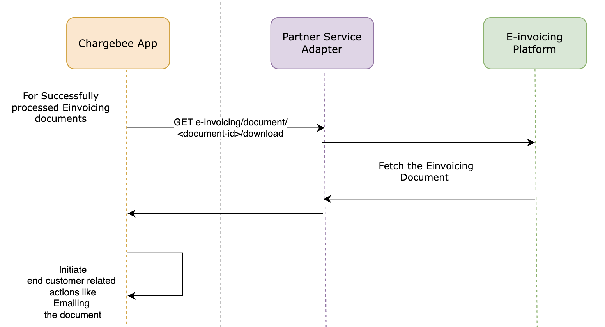

# E-Invoicing SPI Integration

Chargebee streamlines e-invoicing compliance across regions by supporting the following operations throughout the billing lifecycle:

### 1) Retrieve E-invoicing Activations

- Retrieves the list of country and network activations configured in the connected e-invoicing provider platform.
- Each activation corresponds to a specific country and e-invoicing network offered by the provider.
- Chargebee uses this operation during provider enablement to determine which activations can be offered to merchants.

### 2) Document Submission

- Submits invoices and credit notes to external e-invoicing systems for validation, compliance processing, and delivery to tax authorities or trading partners.

### 3) Status Tracking

- Supports asynchronous document lifecycle tracking through webhook notifications sent by the e-invoicing adapter. These updates reflect real-time status changes as documents move through validation, compliance, and regulatory delivery stages.
  

- Allows on-demand status checks to retrieve the latest processing state of submitted documents, ensuring continued visibility even if webhook delivery is delayed or disrupted.
  

### 4) Final Document Retrieval

- Retrieves finalized, regulator-approved documents for archiving, auditing, or customer use.

Chargebee leverages external e-invoicing services to execute these operations effectively. These services are certified vendors offering APIs to manage e-invoicing compliance and document exchange with tax authorities.

---

## The Role of the E-invoicing Adapter App

To communicate with external e-invoicing systems, Chargebee uses an **E-invoicing Adapter App** — a secure and standardized bridge between Chargebee and the e-invoicing system.

This integration is governed by the **E-invoicing Service Provider Interface (SPI)**.

---

## Building an E-invoicing Adapter App

To integrate your e-invoicing system with Chargebee, you must implement the E-invoicing SPI.(You can refer to the spec file for this SPI [here](https://github.com/chargebee/cb-partner-spi/blob/einvoicing_spi_phase2/spec/spi/openapi_einvoicing.yml)). You’ll need to build an adapter app in the following cases:

### As an E-invoicing Provider

Connect your compliance platform to Chargebee so that merchants can automatically submit billing documents in a regulator-approved format.

### As a System Integrator

Build a connector that bridges a third-party e-invoicing provider with Chargebee, enabling seamless integration for merchants.

By implementing the E-invoicing SPI, you enable Chargebee to support **global regulatory compliance** through a **scalable and region-agnostic architecture**.

## JSON Schema for Einvoicing Provider

Below is the Chargebee E-invoicing [JSON Schema](https://json-schema.org/docs). Use this schema to ensure that your E-invoicing data is structured

[View Full E-invoicing provider JSON Schema](https://github.com/chargebee/cb-partner-spi/blob/einvoicing_spi/spec/capabilities/einvoicing-provider.schema.json)